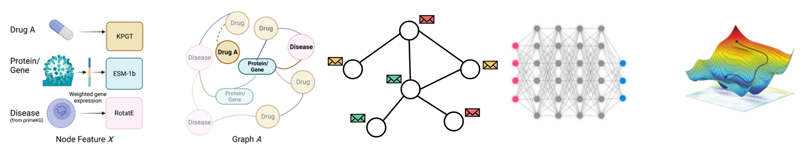
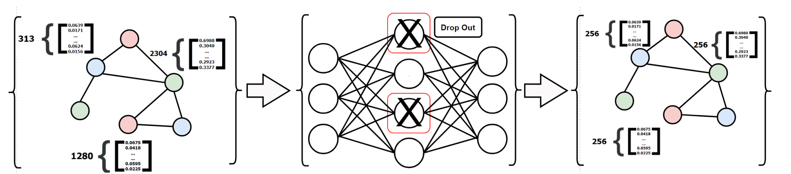
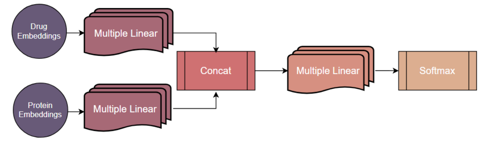

# Overview
HeLU-DTI is a drug target affinity prediction model using Heterogeneous Graph Neural Network and Large Scale Language Models.

## Framework and Pipeline

 

## The GNN Encoder

 

## The MLP Predictive Head

 

